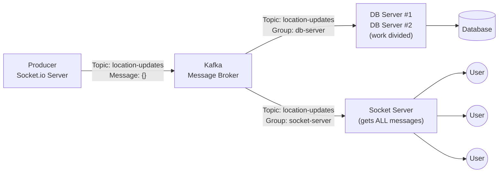

# High Throughput Location Sharing System

A real-time, multi-user location sharing app built to explore high-throughput data pipelines using **Kafka**, **Socket.io**, and **Leaflet**.

---

## How It Works

Every user's browser sends their GPS coordinates to the server via Socket.io every 10 seconds. The server pushes those coordinates into Kafka as a producer. Two separate consumer groups independently read from Kafka:

- **Socket Server Consumer** — broadcasts locations to all connected clients in real-time
- **Database Processor Consumer** — independently processes and persists the data (simulated)



### Key Kafka Concept: Partitioning

`socket.id` is used as the Kafka message key.

```text
Same Socket ID → Same Hash → Same Partition
```

This guarantees that all location updates for a single user are always processed **in order** on the same partition.

---

## Project Structure

```text
├── index.js               # Express + Socket.io server (Producer + Consumer)
├── kafka-client.js        # Shared KafkaJS client instance
├── kafka-admin.js         # One-time topic setup script
├── database-processor.js  # Standalone DB consumer (run separately)
├── docker-compose.yml     # Kafka broker via Docker
└── public/
    └── index.html         # Leaflet map UI + Socket.io client
```

---

## Tech Stack

| Layer       | Technology                   |
|-------------|------------------------------|
| Frontend    | Leaflet.js, Socket.io Client |
| Backend     | Node.js, Express, Socket.io  |
| Message Bus | Apache Kafka (KafkaJS)       |
| Infra       | Docker                       |

---

## Getting Started

### Prerequisites

- Node.js v22+
- Docker Desktop

### 1. Start Kafka

```powershell
docker-compose up -d
```

### 2. Create the Kafka Topic

```powershell
node .\kafka-admin.js
```

This creates the `location-updates` topic with **2 partitions**.

### 3. Start the Socket Server

```powershell
npm run dev
```

### 4. (Optional) Start Database Processors

Open additional terminals to simulate horizontal scaling:

```powershell
# Terminal 2
node .\database-processor.js

# Terminal 3 — Kafka will split the load between the two
node .\database-processor.js
```

Open `http://localhost:3000` in your browser. Allow location access. Your marker will appear on the map immediately.

---

## Consumer Groups Explained

| Group ID             | Instances | Behavior                                                          |
|----------------------|-----------|-------------------------------------------------------------------|
| `socket-server-3000` | 1         | Receives **all** messages, broadcasts to all connected browsers   |
| `database-processor` | 1–N       | Instances **share** the work. 2 instances = each gets 1 partition |

---

## Future Roadmap

### Phase 1 — Horizontal Scaling for Socket.io (Next)

Currently the Socket.io server is a single instance. Scaling it horizontally introduces a problem: a client connected to Server A won't receive a broadcast emitted by Server B.

#### Solution: Redis Pub/Sub Adapter

- Attach `@socket.io/redis-adapter` to all Socket.io instances.
- All servers subscribe to a shared Redis channel.
- When one server emits, Redis fans it out to all other servers.
- Clients on any server instance receive the update.

### Phase 2 — Authentication

Adding user accounts introduces a large surface area:

- **Auth**: Registration, login, logout, JWT/session management
- **UI**: Dashboard, profile editing, avatar
- **Security**: Rate limiting, input sanitization, CSRF protection
- **Profiles on Map**: Replace `socket.id` markers with user avatars/names
